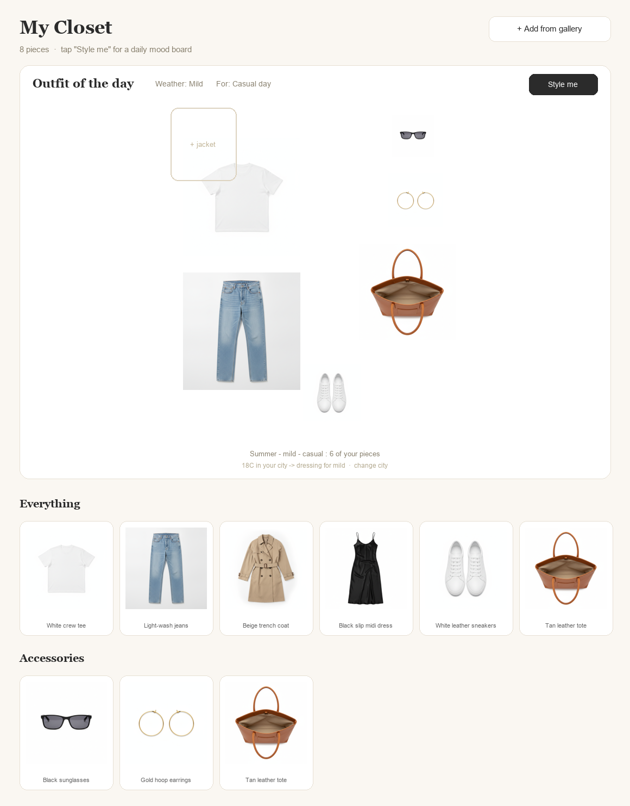

# Digital Closet

Your real wardrobe, digitized — clean cutouts of your actual clothes, organized
into sections, with a Pinterest-style **outfit-of-the-day mood board** that reads
today's real weather. Private by design: photos never leave your machine.

Built to be driven by [Claude Code](https://claude.com/claude-code): you photograph
clothes, Claude cleans + catalogs them and styles you.



**Try it in 30 seconds** (bundled demo closet, no key needed):

```bash
cp demo/wardrobe.json closet/wardrobe.json && mkdir -p closet/photos && cp demo/photos/* closet/photos/
python3 scripts/serve.py
```

## What it does

- **Mood board generator** — pick the occasion (or let weather auto-set), hit
  *Style me*, get a flat-lay board composed from your own pieces (main piece,
  layer, shoes, bag, sunglasses, jewelry).
- **Live weather** — asks for your location (or a city) and dresses you for
  today via Open-Meteo; warns about rain/snow. No API key.
- **Sections** — Dresses · Tops · Bottoms · Jackets & coats · Activewear ·
  Shoes · Bags · Accessories.
- **Add from gallery** — a button in the app uploads photos straight into the
  intake folder (works from your phone on the same Wi-Fi).
- **AI cleanup** — every photo becomes a clean, hanger-free cutout of the
  *real* garment (no AI-invented clothes).

## Quick start

```bash
git clone <this repo> && cd digital-closet
pip install -r requirements.txt          # just Pillow
python3 scripts/serve.py                 # → http://localhost:8765 (+ phone URL)
```

Open it, tap **Add from gallery**, pick photos of your clothes (one garment per
photo, laid flat works best). Then clean + catalog them:

### Easiest: let Claude Code do it
Open this folder in Claude Code and say **"add my clothes"** — it runs the
cleanup, looks at each piece, and writes the catalog for you. `CLAUDE.md`
teaches it everything.

### Manual: two cleanup ways

**Way 1 — local, free, no key:**
```bash
pip install -r requirements-local.txt
python3 scripts/cleanup_local.py        # rembg matting on your machine
```

**Way 2 — AI erase (removes hangers/hands, keeps the garment identical), with
whichever key you already have** — `cleanup_ai.py` auto-detects it:

| Provider | Key (env or `.env`) | Cost | Quality |
|---|---|---|---|
| ⭐ **Gemini** — *recommended* | `GEMINI_API_KEY` | **free tier** | **best** — this is the model ("nano-banana") that preserves garments most faithfully in our testing |
| **fal.ai** | `FAL_KEY` | ~$0.04/photo | same model + BiRefNet matting (true transparency) — best finish if you're already on fal |
| **OpenAI** | `OPENAI_API_KEY` | ~$0.04/photo | good; slightly more prone to redrawing details |

**Quick setup (the recommended path):**
1. Get a free key at [aistudio.google.com](https://aistudio.google.com) → "Get API key".
2. Copy `.env.example` to `.env` and add the line `GEMINI_API_KEY=your-key`.
3. Run it:

```bash
python3 scripts/cleanup_ai.py                 # auto-picks from your keys
python3 scripts/cleanup_ai.py --provider gemini   # or force one
```

> **What about Claude?** Claude doesn't generate or edit images — but it's the
> *brain* of this project: with Claude Code it looks at every cleaned photo and
> writes your catalog (colors, warmth, formality, seasons) for free.

Both ways write clean PNGs to `closet/photos/` — then add each item to
`closet/wardrobe.json` (schema in `CLAUDE.md`; or let Claude do it).

## Take it with you

```bash
python3 scripts/build_closet.py --embed   # → closet-app.html (images baked in)
```

AirDrop `closet-app.html` to your phone → open in Safari → Share →
**Add to Home Screen**. Offline closet app.

## Photo tips

- One garment per photo, laid flat on a plain contrasting surface.
- No hangers, no hands in frame (the AI can erase them, but flat is cleaner).
- If a cutout comes out wrong, redo it with an anchor:
  `python3 scripts/cleanup_ai.py <photo> --desc "a grey wrap skirt, no sleeves"`

## Privacy

- Photos and catalog live only in `closet/` (gitignored).
- Network calls: Open-Meteo weather (anonymous) and — only if you opt into
  Way 2 — your chosen AI provider for cleanup. That's it.
- The local server binds to your machine/LAN; nothing is published.

## License

MIT
